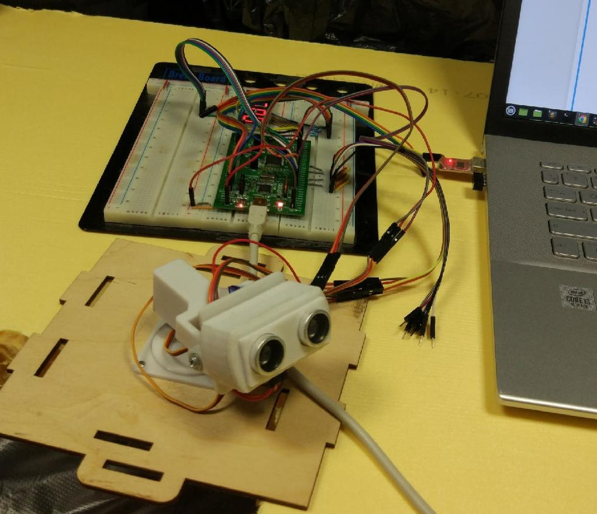
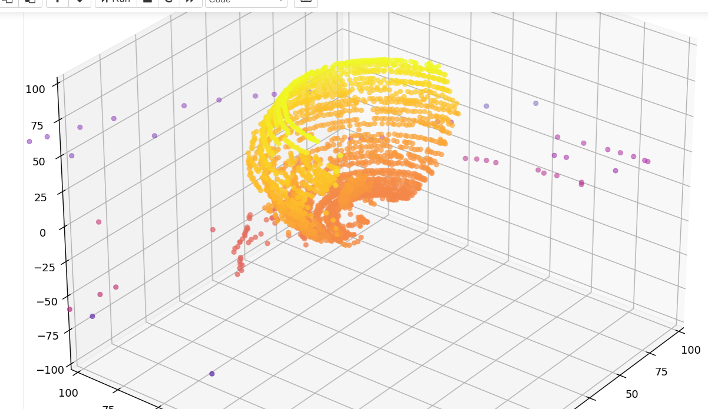

# 3D Scanner Project

## 📖 Overview

A simple real-time **3D scanner** implemented on the **STM32F051R8T6** microcontroller. The system performs automated environmental scanning through coordinated servo movement and ultrasonic distance measurement, generating three-dimensional point cloud data for spatial reconstruction.

| 3D Scanner | Cloud Visualization |
|:--------------:|:----------------:|
|  |  |

## 🔧 Hardware Components
- **Microcontroller**: STM32F051R8T6
- **Distance Sensor**: HC-SR04 Ultrasonic Sensor
- **Communication**: CP2102 USB-TTL Converter
- **Actuators**: 2 Servo Motors
- **Display**: 7-Segment Indicator

## 🚀 Workflow

### Initialization
1. Program STM32 using ST-Link or compatible programmer
2. Configure host software for appropriate COM port
3. Calibrate servo end-stops and scanning range
4. Initiate scanning sequence and monitor data stream

### Scanning Process
- **Servo Control**: 
   - Two servos position the ultrasonic sensor in 3D space
   - Synchronized movement for systematic spatial coverage

- **Distance Measurement**:
   - Ultrasonic sensor captures distance to objects
   - Real-time distance values displayed on 7-segment indicator

- **Coordinate Transformation**:
   - Spherical to Cartesian Conversion using Euler angles
   - Distance measurements transformed to (x,y,z) coordinates

- **Data Transmission**:
   - Continuous UART streaming of 3D coordinate data triplets
   - Uninterrupted data flow for each measured point

